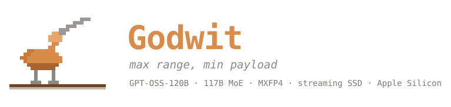
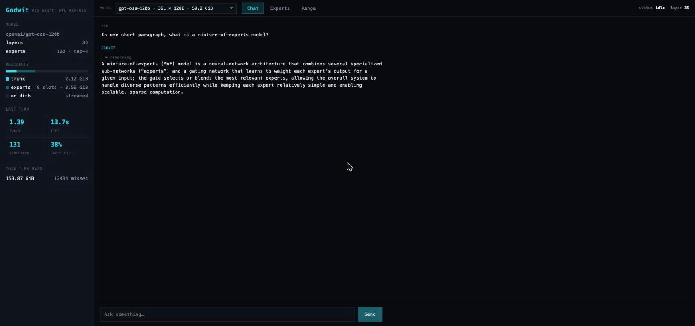
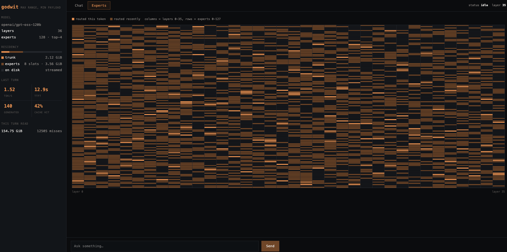
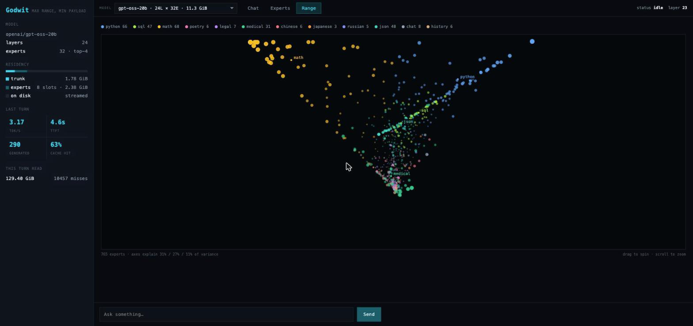
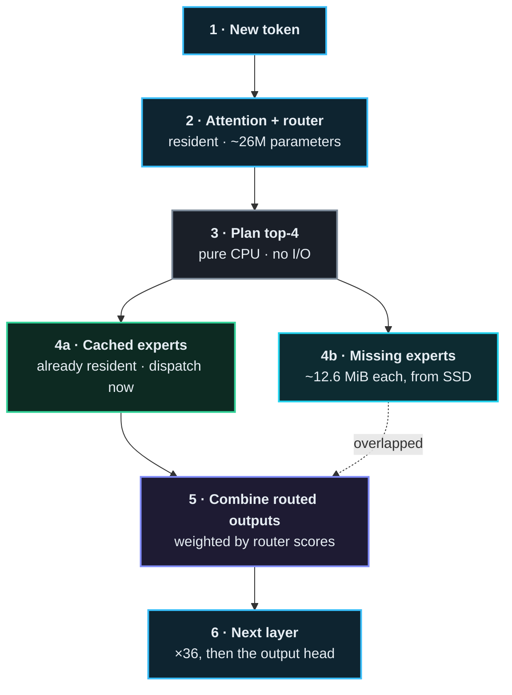

<div align="center">



[](https://github.com/rayl15/Godwit/actions/workflows/ci.yml)
[](https://github.com/rayl15/Godwit/releases)
[](LICENSE)
[](https://swift.org)
[](#requirements)
[](#model-support)
[](Package.swift)
[](https://rayl15.github.io/Godwit/)

**Run a 120-billion-parameter model on a 16 GB laptop.**

</div>

A bar-tailed godwit flies roughly 13,500 km without landing, without eating, on
a body weighing about half a pound. Maximum range, minimum payload. That is the
whole idea.

Godwit runs [GPT-OSS-120B](https://huggingface.co/openai/gpt-oss-120b) — 59 GiB
on disk — on an Apple Silicon Mac with 16 GB of memory, by keeping only the
shared trunk resident and streaming mixture-of-experts weights from SSD as the
router asks for them. Swift and Metal, no dependencies.

It also runs GPT-OSS-20B and Qwen3-30B-A3B, from the same binary, switchable at
runtime. See [model support](#model-support).



## Why

Modern open-weight MoE models are enormous on disk but activate a small
fraction of their parameters per token. GPT-OSS-120B has 128 experts per layer
and uses **four** of them for any given token — about 3% of the model.

Every mainstream runtime still requires all of it to be resident, so the disk
footprint sets the memory requirement and a 59 GiB model needs a 64 GiB
machine. Godwit doesn't. The trunk — embeddings, attention, routers, norms —
stays in memory at 2.12 GiB. The experts live on disk and arrive when chosen.

The cost is throughput. You are trading tokens per second for the ability to
run the model at all, and on a base MacBook Air that trade currently buys about
1.4 tokens per second. The bet is that slow beats impossible.

## What it does

Three views, served by the binary itself — no npm, no build step, no assets.

### Live expert routing

Every one of the model's 4,608 experts, 36 layers across and 128 down, lighting
up as the router selects them. Exactly 144 cells — 3.1% — fire for any single
token.



The near-uniform speckle is a finding, not noise: adjacent layers share only
**4.8%** of their experts, against 3.1% for a random guess. Consecutive tokens
at one layer share 54%, which is why caching along the token axis works.

**That measurement is narrower than it was once made to carry.** It says an
expert chosen at layer *n* is no guide to layer *n+1* — so you cannot prefetch
by reusing the previous layer's choices. This README previously concluded from
it that prefetching does not work at all. That does not follow, and it is
wrong: the usable method is to run layer *n+1*'s **router** early on layer *n*'s
hidden state, which predicts the choices rather than assuming they repeat.
[colibrì](https://github.com/JustVugg/colibri) does exactly this and reports it
working. Godwit does not implement it, and the reason recorded here for not
doing so was a measurement that answered a different question.

### Range map

What each expert is actually *for*, measured rather than guessed. A range map is
the ornithologist's chart of where a species is found; this is the same idea
over topic space.



`godwit range` probes the router with twelve kinds of text — Python, SQL,
proofs, poetry, contracts, clinical notes, Chinese, Japanese, Russian, JSON,
casual chat, history — two samples of each, and records which experts fire for
them. Position comes from the principal components of those affinity vectors, so
experts sit together because they respond to the same material. Nothing is
trained.

The three axes explain 24% / 19% / 12% of the variance, so this is a genuine
projection of higher-dimensional structure rather than the whole picture.

**Counts are of experts that fired often enough to mean it.** An expert selected
twice, both times on Python, scores as a pure specialist on two samples — noise
in the costume of a finding. A label is only credited above 24 activations,
twice the number of topics, below which an expert averages under two
observations per topic. Under-sampled experts stay on the plot, drawn faintly,
because they are real routing; they are simply not counted as evidence of
anything.

On the 120B that bar is not cosmetic: **40% of the 4,475 plotted experts fall
below it**, and the `python` count drops from 516 to 248. An earlier version of
this README reported the larger number.

## Status

Working, self-contained, and slow. Measured on a 13" M4 MacBook Air with the
base 256 GB SSD:

| | |
| --- | ---: |
| Decode | 1.4–1.5 tok/s, flat across the generation |
| Prefill | ~2.2 tok/s |
| Time to first token | 10–13 s first turn, ~4 s after |
| Resident | 2.12 GiB trunk + 3.56 GiB expert slots |
| GPU busy | 17.6% of wall time |

**That is device speed, not an inefficiency.** Expert reads are 71.6% of decode
and the read path already runs at what this SSD delivers. Small Apple SSDs use
fewer NAND dies and are genuinely slower — this one reads ~2 GiB/s, where
512 GB–2 TB modules reach 3–6. The same code should reach roughly 3–5 tok/s on a
Mac with a larger SSD, which has not been verified because no such machine was
available.

Full numbers, including everything that did not work, in
[docs/RESULTS.md](docs/RESULTS.md).

## Requirements

- Apple Silicon Mac, macOS 26+, Swift 6.2+
- 16 GB of memory
- Free space on fast internal storage for the model you want: ~60 GB for
  GPT-OSS-120B, ~17 GB for Qwen3-30B-A3B, ~12 GB for GPT-OSS-20B
- One to three hours for the first install, depending on the model

Xcode is not required; shaders compile at run time, so the Command Line Tools
are enough.

## Quick start

```bash
git clone https://github.com/rayl15/Godwit.git
cd Godwit
swift build -c release

# Stream and repack the checkpoint. ~59 GiB, about 3 hours.
.build/release/godwit install --output model.gwt

# Talk to it.
.build/release/godwit chat --model model.gwt

# Or open the dashboard on 127.0.0.1:8080.
.build/release/godwit serve --model model.gwt
```

Build the range map. The dashboard offers a button when the loaded model has
none; from the command line (a few minutes — 3m44s for Qwen3's 48 layers):

```bash
.build/release/godwit range --model model.gwt -o model.gwt/range.json
```

Try the pipeline without the full transfer by installing a single layer:

```bash
.build/release/godwit install --output test.gwt --layers 1
```

## Commands

| | |
| --- | --- |
| `install` | Stream and repack the checkpoint into a `.gwt` directory |
| `chat` | Interactive, or one-shot with `--prompt` |
| `serve` | Web dashboard on loopback |
| `range` | Probe the router to measure expert specialisation |
| `tokenize` | Encode and decode with the model's own tokeniser |
| `generate` | Raw token-in, token-out, for scripting |
| `logits` | Run the full model and show next-token candidates |
| `check-expert`, `check-attention`, `check-layer`, `verify-expert` | Compare against NumPy references |
| `check-mxfp4` | Re-encode installed MXFP4 and demand byte equality |
| `bench dequant`, `ab-kernel` | Kernel throughput and A/B testing |
| `trace-layers`, `trace-routing` | Measure routing behaviour |

`chat` and `serve` accept `--temperature`, `--top-k`, `--top-p`,
`--repetition-penalty`, `--seed`, `--greedy`, `--slots` and `--lookahead`.

`--lookahead` runs each layer's router on the residual entering it, before
attention, and starts reading the experts it predicts — 87–91% of them
correctly. Measured at **+3.1%** over 9 interleaved pairs (p = 0.002), which is
small because the read still has to happen; it just starts earlier. Off by
default.

## How it works

Per token, per layer:



The asymmetry between steps 2 and 4 is the entire project. Attention touches
resident weights that never move; the expert branch selects 4 of 128 and pulls
roughly 50 MiB off disk to do it. Multiply by 36 layers and a token costs about
1.2 GiB of reads — which is why the design is bound by storage rather than by
arithmetic, and why the GPU sits idle 82% of the time.

- **[docs/DESIGN.md](docs/DESIGN.md)** — architecture, the `.gwt` layout,
  numerical precision, how to benchmark on a thermally unstable machine, and
  every kernel result including the negative ones.
- **[docs/RESULTS.md](docs/RESULTS.md)** — what the finished engine measures.
- **[docs/ESTIMATE.md](docs/ESTIMATE.md)** — the feasibility case made *before*
  building, kept for the reasoning. Several of its numbers were later overturned
  and it says so.

## Development

```bash
Scripts/test.sh              # 82 tests; works without full Xcode
Scripts/ab_kernel.sh         # A/B two kernels with thermal drift controlled
python3 Scripts/analysis/verify_install.py model.gwt
```

Use `Scripts/test.sh` rather than `swift test` directly — on a machine with only
the Command Line Tools, Swift Testing needs framework and rpath flags the script
supplies.

Correctness is checked against NumPy references built from the same installed
bytes, at every stage: MXFP4 decode and encode, expert feed-forward, attention
both with sinks (GPT-OSS) and with QK-norm and without sinks (Qwen3), a complete
layer including exact expert selection, and the tokeniser against `tiktoken`.

`verify_install.py` is GPT-OSS-specific — it demands byte equality, which only
holds when the experts were copied through rather than quantised. Use
`verify_qwen3.py` for a quantised install.

## Model support

**GPT-OSS-120B, GPT-OSS-20B and Qwen3-30B-A3B**, from one binary. Selecting a
model is a flag:

```bash
godwit install --output qwen3.gwt --model-id Qwen/Qwen3-30B-A3B
```

| | GPT-OSS-120B | GPT-OSS-20B | Qwen3-30B-A3B |
| --- | ---: | ---: | ---: |
| Layers | 36 | 24 | 48 |
| Experts per layer | 128 | 32 | 128 |
| Active per token | 4 | 4 | 8 |
| Install size | 59.2 GiB | 11.2 GiB | 16.1 GiB |
| Install time | ~3 h | ~40 min | 105 min |
| Resident | 5.7 GiB | 4.1 GiB | 2.5 GiB |
| Decode | 1.4 tok/s | 2.8–3.2 tok/s | **2.3 tok/s** |
| Time to first token | 10–13 s | ~5 s | 4.5 s |
| Expert cache hit | ~38% | ~60% | ~32% |

Time to first token is the first turn. Later turns reuse the cached prefix and
flatten at about 4.3 s however long the conversation gets — 2.7x faster by the
sixth turn, and it stops growing rather than growing more slowly.

Cache hit rates are for a short single turn and rise over a generation as the
cache warms. They do not carry across turns: prefill touches 50–70 experts per
layer through 8 slots, so it evicts everything it loads. Qwen3's is structurally
lower because it routes to eight experts per token against GPT-OSS's four,
touching twice as many through the same eight slots.

### What a second family cost

GPT-OSS-20B ran first time with no change beyond declaring the spec, which was a
narrow result — same family, so tensor naming, RoPE, activation, sinks and
tokeniser were never exercised.

**Quantisation does not appear to hurt Qwen3 much**, which was worth checking
rather than assuming — it is the only model here we quantise ourselves, since
GPT-OSS already ships on the MXFP4 grid. Recomputing the expert block from the
original BF16 weights and comparing against the weights on disk gives 11.4%
error on the block's own output, but only 2.7–6.8% of the residual stream it
feeds, with cosine similarity above 0.988. The result that matters is that the
next layer selects **the same eight experts every time** — expert selection is
discrete, and a flip is what would compound. Method and limits in
[docs/RESULTS.md](docs/RESULTS.md).

Qwen3 was the actual test. It took one bug worth recording, because of how it presented. The
model produced fluent English with correct facts and then could not stop —
asked for the capital of France it would say Paris, doubt itself, and re-derive
it until the token budget ran out. That looks exactly like quantisation damage,
and MXFP4 costs Qwen3 18.9 dB where it costs GPT-OSS nothing, so the obvious
conclusion was that 4 bits was not enough and the fix was a 30 GB int8 install.

It was not. The QK-norm weight was declared `half` in the Metal kernel where
every other small trunk tensor is `bfloat` — the same bytes read as a different
number. Attention was wrong by 370x what FP16 explains, while still producing
grammatical text about the right subject.

The check that found it took an hour: a NumPy reference for one Qwen3 attention
block, built from the same installed bytes, compared against the GPU. Guessing
would have cost three hours and the 120B install, and would not have worked.

```bash
python3 Scripts/analysis/qwen3_attention_reference.py qwen3.gwt 0 8 /tmp/ref
godwit check-attention qwen3.gwt /tmp/ref
```

## Prior art

Godwit is an independent, clean-room implementation. It is not a fork.

It was inspired by [TurboFieldfare](https://github.com/drumih/turbo-fieldfare),
which demonstrated that streamed-expert inference is practical on Apple Silicon
and published an unusually honest record of 103 experiments including the
failures. Several of its findings saved dead ends here and are credited
individually in [docs/DESIGN.md](docs/DESIGN.md).

[colibrì](https://github.com/JustVugg/colibri) is a mature engine solving the
same problem across more model families and more hardware. It is further along
than this, and worth your attention if you want something to use rather than
something to read. Godwit differs in being Apple-Silicon-native rather than one
backend of four, and in supporting GPT-OSS, which colibrì did not when this was
last checked — that is a claim about someone else's project and may have aged.

## Contributing

Issues and pull requests welcome. One convention is worth knowing: **claims here
are measured, and negative results are recorded rather than deleted.** Several
design notes exist to stop the next person repeating an experiment that already
failed, and at least three retract an earlier conclusion of my own. If a change
is meant to make something faster, the commit should say by how much and how
that was established.

`godwit ab-kernel` exists because this hardware's thermal drift is larger than
most effects worth measuring — a single before/after timing here is not
evidence.

## License

[Apache 2.0](LICENSE). Model weights are not included and remain governed by
their own terms.
