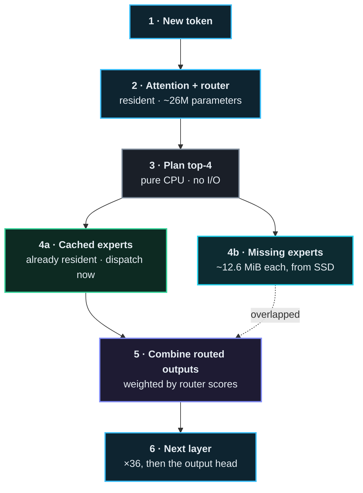

<div align="center">


[](https://github.com/rayl15/Godwit/actions/workflows/ci.yml)
[](https://github.com/rayl15/Godwit/releases)
[](LICENSE)
[](https://swift.org)
[](#requirements)
[](https://huggingface.co/openai/gpt-oss-120b)
[](Package.swift)
[](https://rayl15.github.io/Godwit/)

**Run a 120-billion-parameter model on a 16 GB laptop.**

</div>

A bar-tailed godwit flies roughly 13,500 km without landing, without eating, on
a body weighing about half a pound. Maximum range, minimum payload. That is the
whole idea.

Godwit runs [GPT-OSS-120B](https://huggingface.co/openai/gpt-oss-120b) — 59 GiB
on disk — on an Apple Silicon Mac with 16 GB of memory, by keeping only the
shared trunk resident and streaming mixture-of-experts weights from SSD as the
router asks for them. Swift and Metal, no dependencies.


## Why

Modern open-weight MoE models are enormous on disk but activate a small
fraction of their parameters per token. GPT-OSS-120B has 128 experts per layer
and uses **four** of them for any given token — about 3% of the model.

Every mainstream runtime still requires all of it to be resident, so the disk
footprint sets the memory requirement and a 59 GiB model needs a 64 GiB
machine. Godwit doesn't. The trunk — embeddings, attention, routers, norms —
stays in memory at 2.12 GiB. The experts live on disk and arrive when chosen.

The cost is throughput. You are trading tokens per second for the ability to
run the model at all, and on a base MacBook Air that trade currently buys about
1.4 tokens per second. The bet is that slow beats impossible.

## What it does

Three views, served by the binary itself — no npm, no build step, no assets.

### Live expert routing

Every one of the model's 4,608 experts, 36 layers across and 128 down, lighting
up as the router selects them. Exactly 144 cells — 3.1% — fire for any single
token.


The near-uniform speckle is a finding, not noise. If routing were predictable
across layers, the next layer's experts could be fetched while the current one
computes. It is not: layer *n* predicts layer *n+1* only 4.8% of the time,
against 3.1% for a random guess.

### Range map

What each expert is actually *for*, measured rather than guessed. A range map is
the ornithologist's chart of where a species is found; this is the same idea
over topic space.


`godwit range` probes the router with twelve kinds of text — Python, SQL,
proofs, poetry, contracts, clinical notes, Chinese, Japanese, Russian, JSON,
casual chat, history — two samples of each, and records which experts fire for
them. Position comes from the principal components of those affinity vectors, so
experts sit together because they respond to the same material. Nothing is
trained.

The three axes explain 24% / 19% / 12% of the variance, so this is a genuine
projection of higher-dimensional structure rather than the whole picture.

**Counts are of experts that fired often enough to mean it.** An expert selected
twice, both times on Python, scores as a pure specialist on two samples — noise
in the costume of a finding. A label is only credited above 24 activations,
twice the number of topics, below which an expert averages under two
observations per topic. Under-sampled experts stay on the plot, drawn faintly,
because they are real routing; they are simply not counted as evidence of
anything.

On the 120B that bar is not cosmetic: **40% of the 4,475 plotted experts fall
below it**, and the `python` count drops from 516 to 248. An earlier version of
this README reported the larger number.

## Status

Working, self-contained, and slow. Measured on a 13" M4 MacBook Air with the
base 256 GB SSD:

| | |
| --- | ---: |
| Decode | 1.4–1.5 tok/s, flat across the generation |
| Prefill | ~2.2 tok/s |
| Time to first token | 10–13 s |
| Resident | 2.12 GiB trunk + 3.56 GiB expert slots |
| GPU busy | 17.6% of wall time |

**That is device speed, not an inefficiency.** Expert reads are 71.6% of decode
and the read path already runs at what this SSD delivers. Small Apple SSDs use
fewer NAND dies and are genuinely slower — this one reads ~2 GiB/s, where
512 GB–2 TB modules reach 3–6. The same code should reach roughly 3–5 tok/s on a
Mac with a larger SSD, which has not been verified because no such machine was
available.

Full numbers, including everything that did not work, in
[docs/RESULTS.md](docs/RESULTS.md).

## Requirements

- Apple Silicon Mac, macOS 26+, Swift 6.2+
- 16 GB of memory
- ~60 GB of free space on fast internal storage
- A few hours for the first install

Xcode is not required; shaders compile at run time, so the Command Line Tools
are enough.

## Quick start

```bash
git clone https://github.com/rayl15/Godwit.git
cd Godwit
swift build -c release

# Stream and repack the checkpoint. ~59 GiB, about 3 hours.
.build/release/godwit install --output model.gwt

# Talk to it.
.build/release/godwit chat --model model.gwt

# Or open the dashboard on 127.0.0.1:8080.
.build/release/godwit serve --model model.gwt
```

Build the range map (about 3 minutes; the dashboard picks it up automatically):

```bash
.build/release/godwit range --model model.gwt -o model.gwt/range.json
```

Try the pipeline without the full transfer by installing a single layer:

```bash
.build/release/godwit install --output test.gwt --layers 1
```

## Commands

| | |
| --- | --- |
| `install` | Stream and repack the checkpoint into a `.gwt` directory |
| `chat` | Interactive, or one-shot with `--prompt` |
| `serve` | Web dashboard on loopback |
| `range` | Probe the router to measure expert specialisation |
| `tokenize` | Encode and decode with the model's own tokeniser |
| `generate` | Raw token-in, token-out, for scripting |
| `logits` | Run the full model and show next-token candidates |
| `check-expert`, `check-attention`, `check-layer`, `verify-expert` | Compare against NumPy references |
| `check-mxfp4` | Re-encode installed MXFP4 and demand byte equality |
| `bench dequant`, `ab-kernel` | Kernel throughput and A/B testing |
| `trace-layers`, `trace-routing` | Measure routing behaviour |

`chat` and `serve` accept `--temperature`, `--top-k`, `--top-p`,
`--repetition-penalty`, `--seed`, `--greedy` and `--slots`.

## How it works

Per token, per layer:



The asymmetry between steps 2 and 4 is the entire project. Attention touches
resident weights that never move; the expert branch selects 4 of 128 and pulls
roughly 50 MiB off disk to do it. Multiply by 36 layers and a token costs about
1.2 GiB of reads — which is why the design is bound by storage rather than by
arithmetic, and why the GPU sits idle 82% of the time.

- **[docs/DESIGN.md](docs/DESIGN.md)** — architecture, the `.gwt` layout,
  numerical precision, how to benchmark on a thermally unstable machine, and
  every kernel result including the negative ones.
- **[docs/RESULTS.md](docs/RESULTS.md)** — what the finished engine measures.
- **[docs/ESTIMATE.md](docs/ESTIMATE.md)** — the feasibility case made *before*
  building, kept for the reasoning. Several of its numbers were later overturned
  and it says so.

## Development

```bash
Scripts/test.sh              # 82 tests; works without full Xcode
Scripts/ab_kernel.sh         # A/B two kernels with thermal drift controlled
python3 Scripts/analysis/verify_install.py model.gwt
```

Use `Scripts/test.sh` rather than `swift test` directly — on a machine with only
the Command Line Tools, Swift Testing needs framework and rpath flags the script
supplies.

Correctness is checked against NumPy references built from the same installed
bytes, at every stage: MXFP4 decode, expert feed-forward, attention with sinks,
a complete layer including exact expert selection, and the tokeniser against
`tiktoken`.

## Model support

**GPT-OSS-120B, GPT-OSS-20B and Qwen3-30B-A3B**, from one binary. Selecting a
model is a flag:

```bash
godwit install --output qwen3.gwt --model-id Qwen/Qwen3-30B-A3B
```

| | 120B | 20B |
| --- | ---: | ---: |
| Layers | 36 | 24 |
| Experts per layer | 128 | 32 |
| Install size | 58.9 GiB | 11.2 GiB |
| Resident | 5.7 GiB | 4.1 GiB |
| Decode | 1.4 tok/s | **2.8–3.2 tok/s** |

### Qwen3-30B-A3B: runs, but degraded

| | GPT-OSS-120B | Qwen3-30B-A3B |
| --- | ---: | ---: |
| Install | 59 GB | 16 GB |
| Install time | ~3 h | 105 min |
| Decode | 1.4 tok/s | 2.4 tok/s |
| Time to first token | 10–13 s | 4.5 s |
| Expert cache hit | ~60% | 45% |

The engine is right and the output is not good enough to use. Both halves of
that matter.

Right: the installed weights sit 18.5 dB from the checkpoint at every depth,
which is exactly what MXFP4 costs and no more, and a control comparing against
swapped gate/up ordering collapses to -3.0 dB, so the layout is correct rather
than coincidentally plausible. It emits fluent English, correct ChatML, and the
right facts — asked for the capital of France it says Paris.

Not good enough: it then cannot stop. It restates the answer and re-checks it
until the token budget runs out, with reasoning enabled or disabled, greedy or
with Qwen3's own recommended sampling. It knows the answer and will not commit
to it.

The likely cause is quantisation. GPT-OSS ships already on the MXFP4 grid and
loses nothing; Qwen3 ships BF16, and putting it there costs 18.9 dB and about
12% error on every expert's output. **This has not been proved** — the decisive
test is comparing our logits against a NumPy reference built from the same
installed bytes, as `check-layer` does for GPT-OSS, and that reference does not
exist for Qwen3 yet. Until it does, a subtle bug in QK-norm or RoPE cannot be
ruled out, though neither would usually leave grammar and facts intact.

If quantisation is the cause, int8 experts would fix it at 45.3 dB and a 30.4 GB
install.

The 20B ran first time with no change beyond declaring the spec, which was a
real but narrow result: same family, so tensor naming, RoPE, activation, sinks
and tokeniser were never exercised.

**Qwen3 was the actual test**, and it broke seven things rather than the five I
had predicted. Two I had not seen at all:

| | GPT-OSS | Qwen3 |
| --- | --- | --- |
| Experts on disk | stacked, already MXFP4 | one tensor each, BF16 |
| Attention sinks | yes | no |
| QK-norm | no | **yes** |
| Quantisation | copied through | **we do it** |
| Activation | clamped GLU, `+1` shift | plain SwiGLU |
| RoPE | YaRN, factor 32 | plain, theta 1e6 |
| Chat format | harmony | ChatML |

Two of those deserve naming, because both would have run without complaint:

**Attention sinks cannot be zeroed.** The sink enters the softmax denominator
as `exp(sink - max)`, so a sink of 0.0 is not the identity — it adds a whole
unit of mass to every row. It has to be compiled out, not set to nothing.

**MXFP4 has to be written, not copied.** GPT-OSS ships on the 4-bit grid and
loses nothing; Qwen3 is BF16 and costs 18.9 dB going onto it. The encoder is
checked against OpenAI's own bytes — `godwit check-mxfp4` decodes an installed
GPT-OSS expert and re-encodes it, and all 2,073,600 blocks must come back
identical. That check caught a floored exponent and a dropped sign bit, either
of which would have written quietly wrong weights.

## Prior art

Godwit is an independent, clean-room implementation. It is not a fork.

It was inspired by [TurboFieldfare](https://github.com/drumih/turbo-fieldfare),
which demonstrated that streamed-expert inference is practical on Apple Silicon
and published an unusually honest record of 103 experiments including the
failures. Several of its findings saved dead ends here and are credited
individually in [docs/DESIGN.md](docs/DESIGN.md).

[colibrì](https://github.com/JustVugg/colibri) is a mature engine solving the
same problem across more model families and more hardware. It is further along
than this, and worth your attention if you want something to use rather than
something to read. Godwit differs in being Apple-Silicon-native rather than one
backend of four, and in supporting GPT-OSS, which colibrì does not.

## Contributing

Issues and pull requests welcome. One convention is worth knowing: **claims here
are measured, and negative results are recorded rather than deleted.** Several
design notes exist to stop the next person repeating an experiment that already
failed, and at least three retract an earlier conclusion of my own. If a change
is meant to make something faster, the commit should say by how much and how
that was established.

`godwit ab-kernel` exists because this hardware's thermal drift is larger than
most effects worth measuring — a single before/after timing here is not
evidence.

## License

[Apache 2.0](LICENSE). Model weights are not included and remain governed by
their own terms.
